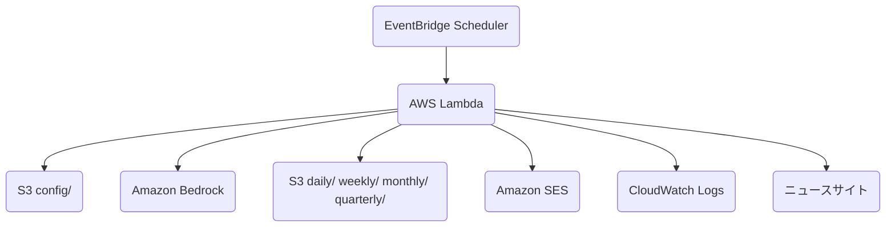

# Bedrock Claude 自動ニュース分析 Lambda

AWS Lambda 上で日本の技術ニュースを収集し、Amazon Bedrock の Claude モデルで分析して、結果を S3 に保存するサーバーレスアプリケーションです。日次・週次・月次・四半期の分析に対応し、必要に応じて Amazon SES で分析結果への期限付き S3 URL を通知します。

## アーキテクチャ



1. EventBridge が `analysis_type` を渡して Lambda を定期実行します。
2. Lambda が S3 の設定ファイルとプロンプトを読み込みます。
3. 日次分析では RSS と記事本文を取得し、Bedrock で分析します。
4. 週次・月次・四半期分析では S3 の前段レポートを読み込み、Bedrock で集約します。
5. 分析結果と記事一覧を S3 に保存し、設定が有効な場合は SES で presigned URL を通知します。

## 主な機能

- 日次・週次・月次・四半期のニュース分析
- RSS と本文抽出による技術ニュース収集
- Amazon Bedrock Claude モデルによる分析レポート生成
- 分析結果のテキスト保存と公開用 HTML 保存
- S3 配置の `config.json` とプロンプトによる設定外部化
- Amazon SES によるメール通知
- Secrets Manager に保存した署名用 IAM ユーザーでの長期 presigned URL 生成
- EventBridge によるスケジュール実行

## 使用技術

- AWS Lambda, Amazon S3, Amazon Bedrock, Amazon SES, Amazon EventBridge, CloudWatch Logs, Secrets Manager
- Python 3.11
- Terraform, Makefile, Docker
- `boto3`, `requests`, `feedparser`, `trafilatura`, `beautifulsoup4`, `chardet`

## ディレクトリ構成

```text
bedrock-news-analyzer/
├── lambda_handler.py       # Lambda エントリーポイント
├── llm_fetcher.py          # 全体フロー制御
├── bedrock_client.py       # Amazon Bedrock クライアント
├── news_scraper.py         # RSS 取得・本文抽出
├── report_html_renderer.py # 分析結果HTML変換
├── s3_handler.py           # S3 操作
├── email_notifier.py       # SES メール通知
├── cloudwatch_logger.py    # ロガー
├── config/
│   ├── config.json
│   ├── news_analysis_prompt.txt
│   ├── weekly_news_analysis_prompt.txt
│   ├── monthly_news_analysis_prompt.txt
│   └── quarterly_news_analysis_prompt.txt
├── deploy/
│   ├── deploy.sh
│   ├── build_layer.sh
│   └── policies/
├── infra/
│   └── terraform/         # AWS リソース定義
├── Makefile               # ローカル操作・Terraform実行入口
├── LAMBDA_DEPLOYMENT.md    # AWS デプロイ・運用手順
├── requirements.txt
└── requirements-lambda.txt
```

## 最短セットアップ

詳細な初回構築、IAM、Secrets Manager、SES、EventBridge、ロールバック、トラブルシューティングは [LAMBDA_DEPLOYMENT.md](./LAMBDA_DEPLOYMENT.md) を参照してください。

### 1. ローカル環境

```bash
make setup
source .venv/bin/activate
```

### 2. Terraform 変数

必要に応じて `infra/terraform/terraform.tfvars.example` を `infra/terraform/terraform.tfvars` にコピーし、バケット名、送信元 SES identity、Bedrock モデルを調整します。`*.tfvars` は Git 管理しません。

```bash
cp infra/terraform/terraform.tfvars.example infra/terraform/terraform.tfvars
```

Terraform は `config/config.json` と 4 種類のプロンプトを S3 の `config/` 配下へアップロードします。`bedrock_model`, `bedrock_region`, `email_notification.enabled`, `email_notification.sender`, presigned URL 署名用 Secret 名は Terraform 変数で上書きされます。

### 3. パッケージ作成

```bash
make package-layer
make package-function
```

生成される `lambda-function.zip` と `lambda-layer.zip` は Git 管理しません。

### 4. Terraform 初回構築・更新

```bash
make tf-init
make tf-plan
make tf-apply
```

Terraform は以下を管理します。

- S3 バケット、暗号化、バージョニング、公開アクセスブロック
- 手動作成した CloudFront distribution 向けの `public/` 限定 S3 bucket policy
- S3 `config/config.json` と各プロンプト
- Lambda 実行ロールとインラインポリシー
- Lambda Layer version と Lambda 関数
- EventBridge 4 ルール、ターゲット、Lambda invoke permission
- Secrets Manager Secret コンテナ
- presigned URL 署名用 IAM ユーザーと S3 読み取りポリシー
- 任意の SES identity 作成

長期アクセスキーは Terraform で作成しません。`aws_iam_access_key` は秘密値を Terraform state に残すため、署名用 IAM ユーザーのアクセスキー作成と Secret への登録は手動で行います。

### 5. Secret 登録

`make tf-apply` 後に出力される `signer_iam_user_name` のアクセスキーを AWS CLI またはコンソールで作成し、Secret に JSON で登録します。`aws_session_token` は含めません。

```bash
aws secretsmanager put-secret-value \
  --secret-id claude-news-analyzer/s3-presign-user \
  --region ap-northeast-1 \
  --secret-string '{"aws_access_key_id":"AKIA...","aws_secret_access_key":"..."}'
```

新規 Secret に初回値を入れる場合も `put-secret-value` を使えます。アクセスキー値は Terraform 変数や state に入れないでください。

### 6. ローカル実行

AWS 認証情報と S3 バケットを設定したうえで、モックイベントで Lambda 処理を実行できます。

```bash
export S3_BUCKET_NAME="your-s3-bucket-name"
python lambda_handler.py
```

### 7. 手動 invoke

Terraform 適用後、日次処理を手動実行できます。

```bash
make invoke-daily
```

### 8. 手動/legacy デプロイ

`deploy/deploy.sh` は当面残しますが、標準手順は Terraform です。手動で Lambda だけを更新する用途や切り戻し時の参考として利用してください。

## 設定ファイル

S3 に配置する `config/config.json` でモデル、プロンプト、出力先、スクレイピング、メール通知を制御します。

主要項目:

- `bedrock_model`: 使用する Bedrock モデル ID
- `bedrock_region`: Bedrock 呼び出しリージョン
- `prompt_paths`: `daily`, `weekly`, `monthly`, `quarterly` ごとのプロンプトパス
- `output_prefixes`: 分析結果の S3 プレフィックス
- `public_html`: CloudFront 公開用 HTML コピーの有効化と S3 プレフィックス
- `news_scraping`: RSS と本文取得の対象・並列数・本文長など
- `email_notification`: SES 通知と presigned URL 署名方式

## CloudFront 公開

CloudFront distribution は Terraform では作成しません。AWS Console で CloudFront の Free plan を選び、通常の S3 origin + OAC で手動作成します。推奨設定:

- Origin domain: S3 バケットの regional domain
- Origin path: `/public`
- Origin access: OAC、`signing_behavior = always`
- Viewer protocol policy: redirect HTTP to HTTPS
- Allowed methods: GET, HEAD

作成後、distribution ARN と domain name を `infra/terraform/terraform.tfvars` に設定して `make tf-plan` / `make tf-apply` を実行すると、Terraform が `public/*` のみを CloudFront に許可する bucket policy を作成します。

## 出力ファイル

分析結果はMarkdown本文の `.md` と、閲覧用の `.html` を同じプレフィックスに保存します。`public_html.enabled` が `true` の場合、HTML だけを `public/` 配下にも追加保存します。例:

- 既存の保存先: `s3://claude-news-analyzer/daily/YYYY-MM-DD.html`
- CloudFront 公開用実体: `s3://claude-news-analyzer/public/daily/YYYY-MM-DD.html`
- 公開 URL: `https://<cloudfront-domain>/daily/YYYY-MM-DD.html`

CloudFront は S3 website endpoint ではなく通常の S3 origin + OAC を使い、bucket policy は `public/*` の `s3:GetObject` だけを手動作成した CloudFront distribution に許可します。`config/`、Markdown、記事一覧 txt、元の `daily/weekly/monthly/quarterly/` は公開対象外です。既存 HTML を初回公開する場合は `make publish-existing-html` を実行します。

週次・月次・四半期分析の入力には `.md` を優先して使い、移行期間の互換用として過去の `.txt` も参照します。四半期分析は `monthly/YYYY-MM.md` または `monthly/YYYY-MM.txt` を入力にし、`quarterly/FY2026-Q1.md` と `quarterly/FY2026-Q1.html` の形式で保存します。メール通知の「分析結果」リンクは従来どおり presigned URL の `.html` を指します。日次の収集記事一覧は `daily/YYYY-MM-DD_articles.txt` のままです。

### メール通知

`email_notification.enabled` を `true` にすると、分析完了後に S3 オブジェクトへの presigned URL を SES で送信します。主な項目は次のとおりです。

- `enabled_analysis_types`: 通知対象の分析種別。例: `["daily", "weekly", "monthly", "quarterly"]`
- `sender`: SES で検証済みの送信元アドレス
- `recipients`: 通知先アドレス
- `presigned_url_expires_seconds`: URL 有効期限。Signature Version 4 の上限に合わせ 604800 秒以下
- `presigned_url_signer_type`: `iam_user_secret` を指定すると Secrets Manager の IAM ユーザーキーで署名
- `presigned_url_signing_secret_id`: 署名用 IAM ユーザーキーを保存した Secret 名または ARN
- `presigned_url_signing_secret_region`: Secret を取得するリージョン
- `presigned_url_s3_region`: presigned URL を生成する S3 クライアントのリージョン
- `fail_on_send_error`: メール送信失敗時に Lambda を失敗扱いにするか

署名用 IAM ユーザー、Secrets Manager、SES sandbox、`aws_session_token` を含めない確認などの運用手順は [LAMBDA_DEPLOYMENT.md](./LAMBDA_DEPLOYMENT.md) に集約しています。
