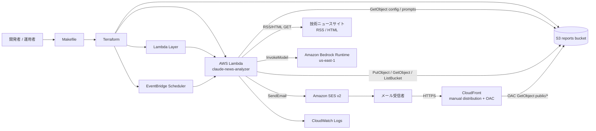
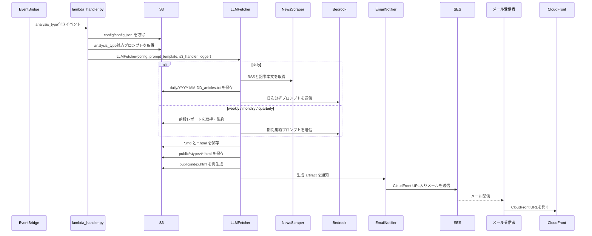
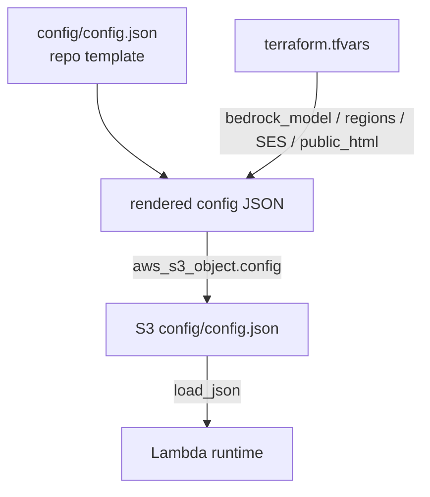

# Bedrock News Analyzer Architecture

## 概要

Bedrock News Analyzer は、EventBridge で定期起動される Python 3.11 AWS Lambda バッチです。日本の技術ニュースを RSS/HTML から収集し、Amazon Bedrock の Claude モデルで日次・週次・月次・四半期レポートを生成し、S3 に保存します。

生成されたレポートは、非公開の集約・再分析用オブジェクトと、CloudFront 公開用 HTML に分かれます。メール通知は S3 presigned URL ではなく、CloudFront 経由の HTML レポートリンクと `index.html` 一覧リンクだけを配信します。

## 全体構成

## 実行フロー

## コンポーネント

| コンポーネント | 管理 | 役割 | 主な根拠 |
| --- | --- | --- | --- |
| EventBridge Rules | Terraform | `daily`, `weekly`, `monthly`, `quarterly` の定期起動。イベント本文に `analysis_type` を渡す。 | `infra/terraform/main.tf`, `variables.tf` |
| AWS Lambda | Terraform | 設定読込、分析種別分岐、ニュース取得、Bedrock 呼び出し、S3 保存、メール通知制御。 | `lambda_handler.py`, `llm_fetcher.py` |
| Lambda Layer | Terraform + Docker | Lambda 実行時依存パッケージを提供。 | `deploy/build_layer.sh`, `deploy/Dockerfile.layer` |
| S3 reports bucket | Terraform | config、prompt、生成レポート、公開HTML実体を保存。公開アクセスブロックと SSE-S3 を有効化。 | `infra/terraform/main.tf`, `s3_handler.py` |
| Amazon Bedrock Runtime | AWS managed | Claude による日次分析・期間集約。Bedrock 実行リージョンは config 上 `us-east-1`。 | `bedrock_client.py`, `config/config.json` |
| 技術ニュースサイト | 外部 | RSS と記事本文の取得元。 | `news_scraper.py`, `config/config.json` |
| CloudFront | 手動作成 + Terraform bucket policy | `public/` 配下だけを OAC で配信。distribution 本体は Terraform 管理外。 | `infra/terraform/main.tf`, `LAMBDA_DEPLOYMENT.md` |
| Amazon SES v2 | Terraform optional + AWS managed | 分析完了メールを送信。本文リンクは CloudFront URL。 | `email_notifier.py`, `config/config.json` |
| CloudWatch Logs | Terraform / Lambda | Lambda 実行ログの保管。 | `cloudwatch_logger.py`, `infra/terraform/main.tf` |
| Legacy presigned URL resources | Terraform | 旧通知方式用の IAM user / Secrets Manager secret。現行 `email_notifier.py` は使用しない。 | `infra/terraform/main.tf`, `LAMBDA_DEPLOYMENT.md` |

## S3 オブジェクト設計

| Prefix | 例 | 用途 | 公開 |
| --- | --- | --- | --- |
| `config/` | `config/config.json`, `config/news_analysis_prompt.txt` | Lambda 実行時設定とプロンプト。 | 非公開 |
| `daily/` | `daily/2026-05-19.md`, `daily/2026-05-19.html`, `daily/2026-05-19_articles.txt` | 日次レポートと収集記事一覧。週次入力にも使う。 | 非公開 |
| `weekly/` | `weekly/2026-05-10_2026-05-16.md`, `.html` | 週次レポート。月次入力にも使う。 | 非公開 |
| `monthly/` | `monthly/2026-05.md`, `.html` | 月次レポート。四半期入力にも使う。 | 非公開 |
| `quarterly/` | `quarterly/FY2026-Q1.md`, `.html` | 四半期レポート。 | 非公開 |
| `responses/` | `responses/YYYY-MM-DD.txt` | 旧日次レポート互換入力。 | 非公開 |
| `public/` | `public/daily/2026-05-19.html`, `public/index.html` | CloudFront 公開用 HTML コピーと一覧。 | CloudFront 経由のみ |

`public_html.enabled` が `true` の場合、HTML レポート保存時に次も行います。

1. 元の HTML を `public/<analysis_type>/...html` にコピーする。
2. `public/` 配下の `.html` を列挙し、`public/index.html` を再生成する。
3. `public/index.html` 自身と非HTMLファイルは一覧対象から除外する。

## 分析種別ごとの入力と出力

| 分析種別 | 起動スケジュール初期値 | 入力 | 出力 | 通知リンク |
| --- | --- | --- | --- | --- |
| `daily` | `cron(0 0 * * ? *)` | RSS/HTML から取得した前日記事 | `daily/YYYY-MM-DD_articles.txt`, `.md`, `.html`, `public/daily/YYYY-MM-DD.html` | HTML レポート + `index.html`。記事 txt は通知しない。 |
| `weekly` | `cron(0 1 ? * SUN *)` | 前週の日次 `.md` 優先、`.txt` と `responses/` は互換 fallback | `weekly/YYYY-MM-DD_YYYY-MM-DD.md`, `.html`, `public/weekly/...html` | HTML レポート + `index.html` |
| `monthly` | `cron(0 2 1 * ? *)` | 前月内に終了した週次レポート | `monthly/YYYY-MM.md`, `.html`, `public/monthly/YYYY-MM.html` | HTML レポート + `index.html` |
| `quarterly` | `cron(0 3 1 1,4,7,10 ? *)` | 4月始まり会計年度の直前四半期に含まれる月次レポート | `quarterly/FYyyyy-QN.md`, `.html`, `public/quarterly/FYyyyy-QN.html` | HTML レポート + `index.html` |

## 設定の流れ

主要設定:

- `bedrock_model`, `bedrock_region`: Bedrock Runtime 呼び出し先。
- `prompt_paths`: 分析種別ごとのプロンプト S3 key。
- `output_prefixes`: レポート保存先 prefix。
- `public_html.enabled`, `public_html.prefix`, `public_html.base_url`: 公開HTMLコピーと CloudFront URL。
- `email_notification.enabled`, `enabled_analysis_types`, `sender`, `recipients`, `ses_region`, `fail_on_send_error`: SES 通知制御。
- `news_scraping`: 取得対象サイト、RSS URL、本文抽出、並列数、タイムアウト。

Terraform は `public_html_cloudfront_domain_name` が空でない場合、`public_html.base_url` を `https://<domain>` として S3 上の config に反映します。

## セキュリティ境界

- S3 bucket は public access block を有効化し、S3 直URLの匿名公開は前提にしない。
- CloudFront は手動作成 distribution + OAC を想定し、Terraform は指定 distribution ARN に対して `public_html.prefix/*` の `s3:GetObject` だけを許可する bucket policy を作る。
- `config/`, `daily/`, `weekly/`, `monthly/`, `quarterly/`, `responses/` は CloudFront 公開対象外。
- メール通知は CloudFront URL のみを配信し、S3 presigned URL は生成しない。
- Lambda 実行ロールは config 読取、出力 prefix への読取/書込、bucket list、CloudWatch Logs、Bedrock invoke、SES send を持つ。
- Terraform には legacy presigned URL 用の IAM user / Secrets Manager secret / Lambda `secretsmanager:GetSecretValue` 権限が残るが、現行通知コードは参照しない。

## デプロイと運用境界

Terraform が管理するもの:

- S3 bucket、暗号化、バージョニング、公開アクセスブロック、CloudFront 向け bucket policy。
- S3 `config/config.json` とプロンプトオブジェクト。
- Lambda execution role、inline policy、Lambda Layer、Lambda function。
- EventBridge rules / targets / Lambda permissions。
- CloudWatch log group。
- optional SES identity。
- legacy presigned URL 用 IAM user / Secrets Manager secret。

Terraform が管理しないもの:

- CloudFront distribution 本体。
- 署名用 IAM user のアクセスキー値。
- SES identity の検証完了状態。
- Bedrock モデル利用許可。
- 実際のニュースサイト可用性やHTML構造変更。

## 障害時の影響範囲

| 障害 | 影響 | 主な確認先 |
| --- | --- | --- |
| S3 config / prompt 読込失敗 | 全分析が開始できない。 | `lambda_handler.py`, CloudWatch Logs, S3 `config/` |
| ニュース取得失敗 | daily の入力記事が不足または空になる。 | `news_scraper.py`, CloudWatch Logs |
| Bedrock 呼び出し失敗 | 対象分析のレポート生成が失敗する。 | `bedrock_client.py`, Bedrock region/model設定 |
| 前段レポート不足 | weekly/monthly/quarterly が入力不足で失敗または警告する。 | S3 `daily/weekly/monthly/`, `llm_fetcher.py` |
| `public_html.base_url` 未設定 | メール通知が失敗する。`fail_on_send_error=false` なら分析自体は成功扱い。 | S3 `config/config.json`, Terraform `public_html_cloudfront_domain_name` |
| CloudFront / OAC / bucket policy 不整合 | メールリンク先の公開HTMLが 403/404 になる。 | CloudFront設定, S3 bucket policy, `public/` object |
| SES 設定不備 | メール通知が送信されない。 | SES identity/sandbox, `email_notification.*`, CloudWatch Logs |

## リポジトリ上の主要ファイル

| Path | 役割 |
| --- | --- |
| `lambda_handler.py` | Lambda entrypoint。S3 config/prompt 読込、分析種別検証、`LLMFetcher` 起動。 |
| `llm_fetcher.py` | 分析フロー制御、期間計算、S3保存、公開HTMLコピー、`index.html` 再生成、メール通知起動。 |
| `news_scraper.py` | RSS/HTML取得、本文抽出、LLM入力整形。 |
| `bedrock_client.py` | Bedrock Runtime `invoke_model` 呼び出し。 |
| `report_html_renderer.py` | Markdown風レポート本文を単体HTMLへ変換。 |
| `s3_handler.py` | S3 get/put/head/list の薄いラッパー。 |
| `email_notifier.py` | SES メール本文生成と送信。CloudFront URLのみを作る。 |
| `infra/terraform/` | AWS リソース定義と S3 config レンダリング。 |
| `deploy/` | Terraform 移行前の legacy/manual デプロイ補助と Layer build。 |
| `Makefile` | setup/test/package/Terraform/CloudFront invalidation の入口。 |

`LLMFetcher` の Lambda 用初期化シグネチャは `LLMFetcher(config, prompt_template, s3_handler, logger)` です。`config` と `prompt_template` は `lambda_handler.py` が S3 から読み込み済みの値を渡し、ローカル直接実行時だけ `llm_fetcher.py` の `__init_local__()` がリポジトリ内の `config/config.json` とプロンプトファイルを読み込みます。

## 現在の制約と前提

- CloudFront distribution は手動作成で、S3 origin path は `/public` を想定する。そのためメールURLに `/public/` は含めない。
- `public/index.html` は Lambda が HTML レポートを公開コピーするたびに再生成する。既存HTMLの初回公開は `make publish-existing-html` でコピーできるが、index再生成は次回レポート生成時に行われる。
- daily の記事一覧 `_articles.txt` は S3 に保存されるが、CloudFront公開・メール通知の対象外。
- legacy presigned URL 用 Terraform リソースは state 影響を避けるため残っている。現行アプリケーションの通知経路では未使用。
